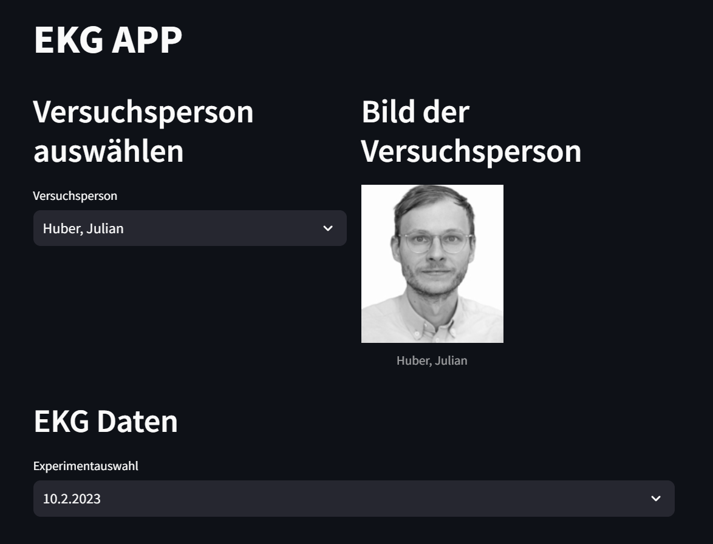
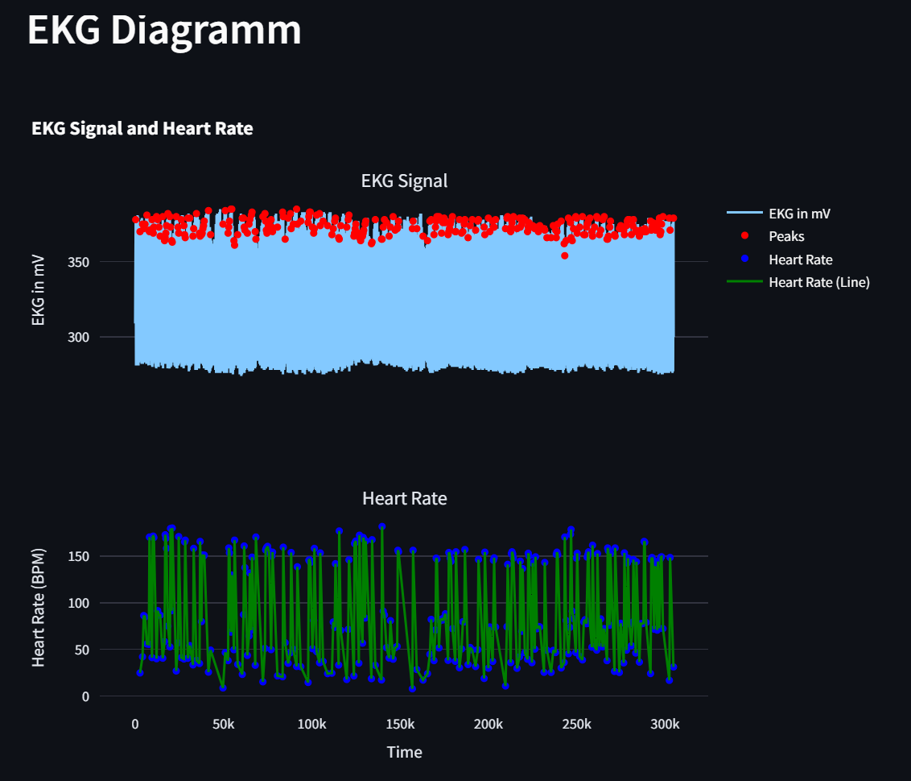

# Interaktiver Plot
Projektmitglieder: Christian Kleber, Matthias Hansen

Es soll ein interaktiver Plot erstellt werden, der die Herzfrequenz und die Leistung in abhängigkeit der Dauer, anhand von fünf Zonen, die abhängig von der maximalen Herzfrequenz sind, darstellt. Außerdem soll die maximale Herzfrequenz durch den Benutzer eingegeben und verändert werden können.

# Leistungskurve II
Nun soll eine Leistungskurve erstellt werden, die basierend auf den Leistungen in Watt eine Power-Curve erstellt. Es soll außerdem angezeigt werden um welche Zeit bzw. Dauer es sich handelt. Außerdem soll immer die maximale Zeitspanne zwischen zwei Werten verwendet werden.

# Objektorientierung
Nun sollen die Klassen ```person```und ```Ekgdata``` um folgende Methoden erweitert werden. Personen sollen in einem Dashboard angezeigt werden, zu diesen sollen die EKG Daten visualisiert werden.Aus diesen soll ein Plot mit angezeigten Peaks erstellt werden. Dafür sollen auch ```static methods```verwendet werden, diese gehören zur Klasse und nicht zur Instanz, das heißt sie können aufgerufen werden ohne das ein neues Objekt erstellt wird. 


## Requirements
folgende Pakete werden benötigt:

siehe ```requirements.txt```

Diese können mit folgendem Befehl gesammelt installiert werden:

```pip install -r requirements.txt```

## Beschreibung und Erklärung der App
Die App kann nach ausführen von main.py über den Befehl ```streamlit run main.py``` aufgerufen werden. Nun kann die gewünschte Person und das gewünschte Experiment ausgewählt werden. Daraufhin können die interaktiven Plots für das EKG Signal und für den Puls eingesehen werden. Außerdem werden dem Benutzer noch der maximale Puls und der Durchschittswert des EKG Signals angezeigt.
## Userinterface




