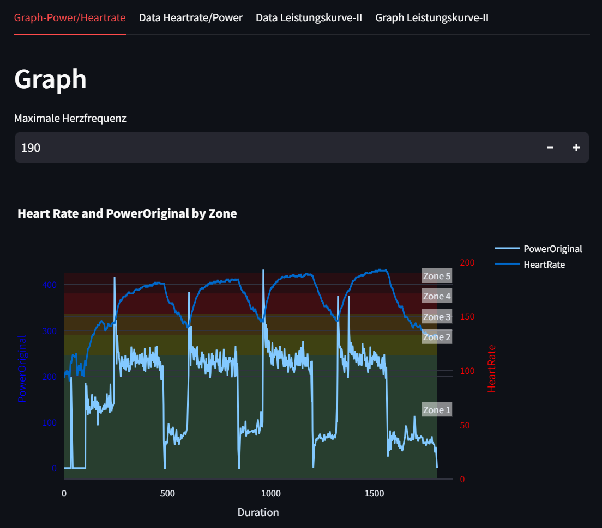
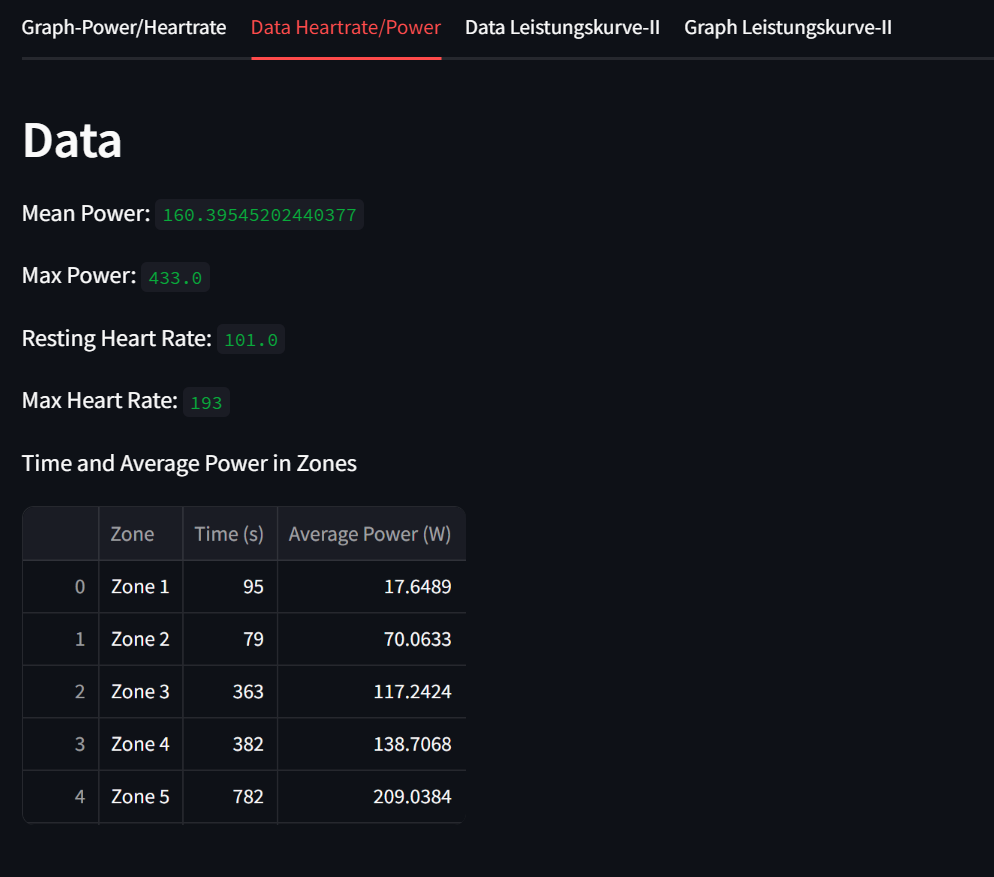

# Interaktiver Plot
Projektmitglieder: Christian Kleber, Matthias Hansen

Es soll ein interaktiver Plot erstellt werden, der in fünf Zonen aufgeteilt ist und die Herzfrequenz und die Leistung darstellt. Außerdem soll interakti die maximale Herzfrequenz über die App eingegeben werden können.

# Requirements
folgende Pakete werden benötigt:

siehe ```requirements.txt```

# Beschreibung und Erklärung der App
Die App kann nach ausführen von main.py über den Befehl ```streamlit run main.py``` aufgerufen werden. Nun kann der interaktive Graph mit den angegebenen Werten eingesehen werden. Der Benutzer kann nun eine maximale Herzfrequenz eingeben, diese darf maximal 220 betragen. Nun können im Bereich Data die verschiedenen Daten eingesehen werden.

# Userinterface




