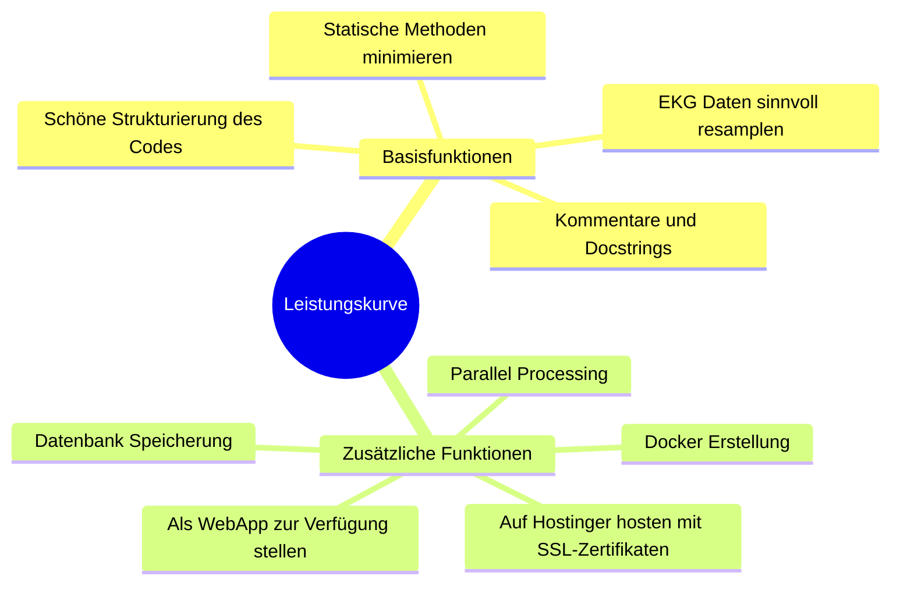
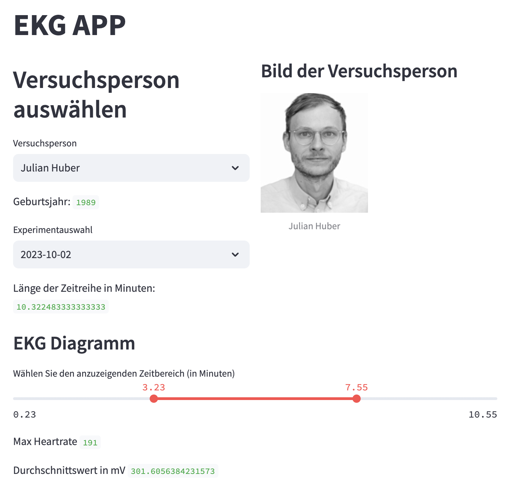
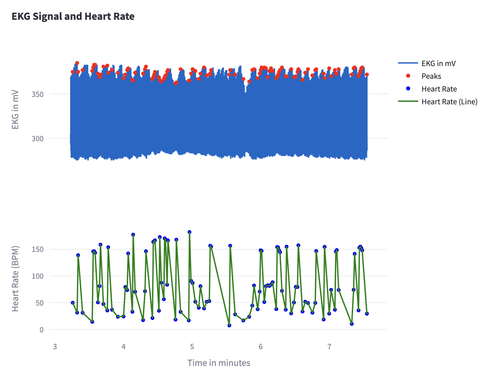
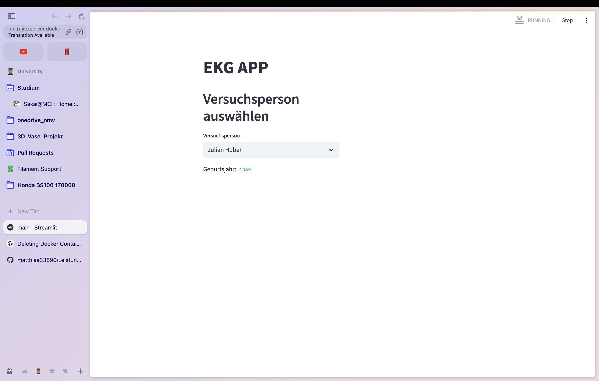
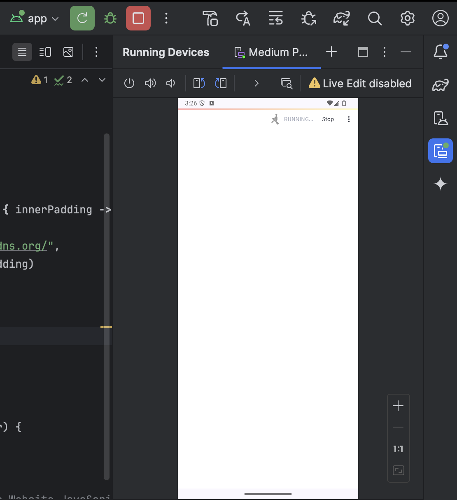

# Interaktiver Plot für Herzfrequenz und Leistung

Projektmitglieder: Christian Kleber, Matthias Hansen

## Projektbeschreibung

Dieses Projekt zielt darauf ab, einen interaktiven Plot zu erstellen, der die Herzfrequenz und die Leistung in Abhängigkeit von der Dauer darstellt. 

### Leistungskurve II

Zusätzlich soll eine Leistungskurve basierend auf den Leistungen in Watt erstellt werden. Diese Power-Curve zeigt die Leistung im Verhältnis zur Zeit bzw. Dauer an. Dabei wird stets die maximale Zeitspanne zwischen zwei Werten verwendet.

### Objektorientierung

Die Klassen `Person` und `Ekgdata` werden um Methoden erweitert, die die Daten in einem Dashboard visualisieren. Ein Plot mit angezeigten Peaks der EKG-Daten soll erstellt werden. Statische Methoden werden verwendet, die zur Klasse und nicht zur Instanz gehören, sodass sie ohne ein neues Objekt aufgerufen werden können.

## Abschlussprojekt (Zusätzliche Funktionen und Basisfunktionen)



### Requirements

Folgende Pakete werden benötigt:

Siehe `requirements.txt`

Diese können mit folgendem Befehl installiert werden:

```bash
pip install -r requirements.txt
```

### Beschreibung und Erklärung der App

Durch `docker-compose up --build -d` können die Docker-Images erstellt werden. Anschließend kann man sich über [http://localhost:8502/](http://localhost:8502/) verbinden.

Nun kann die gewünschte Person und das gewünschte Experiment ausgewählt werden. Daraufhin können die interaktiven Plots für das EKG-Signal und für den Puls eingesehen werden. Außerdem werden dem Benutzer der maximale Puls und der Durchschnittswert des EKG-Signals angezeigt.

## Probleme

### Performance

Das größte Problem war die schnelle Anzeige der Daten. Dies hat auf unseren Laptops dank Multiprocessing halbwegs schnell geklappt. Auf einem VPS, der wesentlich schlechtere Leistung bietet, wurde dieses Problem jedoch deutlich sichtbar. Wir konnten dieses Problem nicht vollständig lösen, ohne weniger Daten zu verarbeiten, was jedoch keinen Sinn gemacht hätte.

### Docker auf VPS

Ein weiteres Problem war, den Docker-Container auf dem VPS richtig zum Laufen zu bringen. Es mussten folgende Änderungen vorgenommen werden:

- Port ändern auf 8502
- Anpassung der `pg_hba.conf`, um mit den Netzwerkrichtlinien übereinzustimmen
- Erstellung einer eigenen Dockerfile für den SQL-Server, sodass die passenden Skripte am Anfang ohne Probleme ausgeführt werden

Alle anderen aufgetretenen Probleme konnten wir jedoch lösen.

## User Interface




Das User Interface ist nicht besonders spannend, da wir uns mehr darauf konzentriert haben, grundlegende Änderungen im Hintergrund zu implementieren.

## SSL Verschlüsselung



Es ist uns gelungen, das Repository/Docker-Image auf dem VPS zum Laufen zu bringen. Dadurch kann man, wenn das Docker-Image läuft, über die Links:

- [https://uni.ravexserver.duckdns.org/](https://uni.ravexserver.duckdns.org/)
- [http://ravexserver.duckdns.org:8502/](http://ravexserver.duckdns.org:8502/)

auf die Streamlit-App zugreifen. Leider läuft die App nicht konsistent auf dem VPS, da es zu einer CPU-Auslastung von 100% kommt, wenn sie aktiv ist.

## Web App



Mittels Android Studio wurde eine Web-App entwickelt. Diese funktionierte zwar, jedoch führte die lange Ladezeit zu einer schlechten Darstellung. Eine APK für diese App wurde ebenfalls erstellt und kann aus dem GitHub-Repository heruntergeladen werden.

## Fazit

Dieses Projekt war sehr interessant und ermöglichte die Umsetzung aller wichtigen Grundlagen in Python. Die zusätzlichen Funktionen gaben uns einen größeren Einblick in die IT-Thematik.