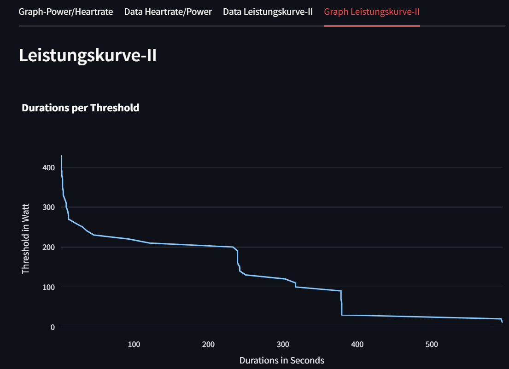

# Interaktiver Plot
Projektmitglieder: Christian Kleber, Matthias Hansen

Es soll ein interaktiver Plot erstellt werden, der die Herzfrequenz und die Leistung in abhängigkeit der Dauer, anhand von fünf Zonen, die abhängig von der maximalen Herzfrequenz sind, darstellt. Außerdem soll die maximale Herzfrequenz durch den Benutzer eingegeben und verändert werden können.

# Leistungskurve II
Nun soll eine Leistungskurve erstellt werden, die basierend auf den Leistungen in Watt eine Power-Curve erstellt. Es soll außerdem angezeigt werden um welche Zeit bzw. Dauer es sich handelt. Außerdem soll immer die maximale Zeitspanne zwischen zwei Werten verwendet werden.


## Requirements
folgende Pakete werden benötigt:

siehe ```requirements.txt```

Diese können mit folgendem Befehl gesammelt installiert werden:

```pip install -r requirements.txt```

## Beschreibung und Erklärung der App
Die App kann nach ausführen von main.py über den Befehl ```streamlit run main.py``` aufgerufen werden. Nun kann der interaktive Graph im Bereich ```Graph-Power/Heartrate``` mit den angegebenen Werten eingesehen werden. Der Benutzer kann nun eine maximale Herzfrequenz eingeben, diese darf maximal 220 betragen. Es können im Bereich ```Data Heartrate/Power``` die verschiedenen Daten eingesehen werden. Im Bereich ```Data Leistungskurve-II```können die Daten zu den gegeben Werten eingesehen, die für die Power Curve benötigt werden, die im Bereich ```Graph Leistungskurve-II```eingesehen werden kann.

## Userinterface





